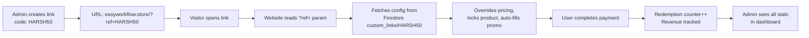

# Custom Links System — Full Admin Control

Build a **Custom Links** system where you (admin) can generate shareable URLs with custom pricing, discounts, product restrictions, and redemption limits — all manageable from the admin panel.

## How It Works (User Flow)



---

## Firestore Schema

### `custom_links/{linkCode}` document:

```js
{
  code: "HARSH50",                    // Link code (document ID)
  active: true,                       // Enable/disable toggle
  
  // PRODUCT TARGETING
  products: ["pro", "autocaptions"],  // Which products this link works for (empty array = ALL)
  
  // PRICING MODE: "discount" or "fixed"
  pricingMode: "discount",            // "discount" = % off, "fixed" = exact custom price
  discountPercent: 50,                // Used when pricingMode === "discount"
  fixedPrices: {                      // Used when pricingMode === "fixed"
    pro_inr: 750, pro_usd: 9,
    autocaptions_inr: 400, autocaptions_usd: 5,
    // ... only products in `products[]` need prices
  },
  
  // LIMITS
  maxRedemptions: 100,                // 0 = unlimited
  currentRedemptions: 0,              // Auto-incremented on purchase
  
  // TRACKING
  totalSalesINR: 0,                   // Total revenue from this link
  totalSalesUSD: 0,
  
  // METADATA
  note: "YouTube collab discount",    // Admin's internal note
  createdAt: serverTimestamp(),
  expiresAt: null                     // Optional expiry date (null = never)
}
```

---

## Proposed Changes

### Firestore Rules

#### [MODIFY] [firestore.rules](file:///c:/Users/HARSH/Desktop/softwherehub-main%20-%20Copy/firestore.rules)
- Add a new `custom_links` collection rule: **public read** (visitor needs to fetch link config), **admin-only write** (only authenticated admin can create/edit/delete).
- Add rule to allow the website to **increment** `currentRedemptions`, `totalSalesINR`, `totalSalesUSD` fields on payment success.

---

### Admin Panel — New "Custom Links" Page

#### [MODIFY] [index.html](file:///c:/Users/HARSH/Desktop/softwherehub-main%20-%20Copy/admin/index.html)

**Sidebar:** Add a new nav item `Custom Links` with a link icon between "Promo Codes" and "Payments".

**New Page (`#page-customlinks`)** containing:

1. **Stats Row** — 4 mini stat cards:
   - Total Active Links
   - Total Redemptions (all links)
   - Total Revenue from Links
   - Average Discount %

2. **Create Link Form** (card):
   - Link Code input (uppercase, auto-slugified)
   - Product Targeting: multi-select checkboxes for `pro`, `autocaptions`, `projectmanager`, `basic` (or "All Products")
   - Pricing Mode toggle: `Discount %` or `Fixed Price`
     - If Discount: discount percentage slider/input (1-100)
     - If Fixed: price inputs per targeted product (INR + USD)
   - Max Redemptions input (0 = unlimited)
   - Expiry Date picker (optional)
   - Internal Note (textarea)
   - **"Create Link"** button

3. **Links Table** (card):
   - Columns: Code, Products, Discount/Price, Redemptions (current/max), Revenue, Status, Created, Actions
   - Actions: Copy Link URL, Edit, Toggle Active, Delete
   - Each row is clickable to show detailed stats

4. **Edit Modal** — Same fields as Create, pre-filled with existing data.

---

#### [MODIFY] [admin.js](file:///c:/Users/HARSH/Desktop/softwherehub-main%20-%20Copy/admin/admin.js)

Add the complete Custom Links management module:

- `listenToCustomLinks()` — real-time Firestore listener on `custom_links` collection
- `renderCustomLinks()` — render the table with search/filter support
- `createCustomLink()` — validate + save new link doc to Firestore
- `editCustomLink(code)` — open edit modal with pre-filled data
- `updateCustomLink(code)` — save changes
- `toggleCustomLinkActive(code)` — enable/disable toggle
- `deleteCustomLink(code)` — delete with confirmation
- `copyLinkUrl(code)` — copy `https://easyworkflow.store/?ref=CODE` to clipboard
- `updateCustomLinksStats()` — aggregate stats from all link docs
- Add `customlinks` to `titleMap` and `initDashboard()`

---

#### [MODIFY] [admin.css](file:///c:/Users/HARSH/Desktop/softwherehub-main%20-%20Copy/admin/admin.css)

Add styles for:
- Custom links stats cards
- Create/edit link form layout
- Product checkbox grid
- Pricing mode toggle switch
- Link URL copy button with tooltip
- Edit modal overlay

---

### Main Website — `?ref=` Parameter Detection & Override

#### [MODIFY] [script.js](file:///c:/Users/HARSH/Desktop/softwherehub-main%20-%20Copy/script.js)

1. **On Page Load** — detect `?ref=CODE` URL parameter:
   - Fetch `custom_links/CODE` from Firestore
   - Validate: `active === true`, not expired, redemptions < max (or unlimited)
   - Store in `window.activeCustomLink` for use throughout checkout

2. **Show Custom Link Banner** — subtle top banner: *"🎁 Special offer applied: 50% off Easy Workflow Pro"*

3. **Price Override Logic** — in `applyPricingToPage()`:
   - If `window.activeCustomLink` exists and `pricingMode === "discount"`:
     - Apply discount percent to all targeted product prices
     - Show strikethrough original + discounted price
   - If `pricingMode === "fixed"`:
     - Replace prices for targeted products with `fixedPrices` values

4. **Product Lock** (optional):
   - If the link targets specific products, auto-switch to that product's version
   - The version toggle remains functional (not locked) so users can browse

5. **Checkout Modal Override**:
   - Auto-fill promo code field with the custom link code (or hide it)
   - Override `currentPromoMultiplier` with the custom link discount
   - Pass `customLinkCode` to payment data for tracking

6. **On Payment Success** — update the custom link document:
   - Increment `currentRedemptions` by 1
   - Add the payment amount to `totalSalesINR` or `totalSalesUSD`

---

### Netlify Functions — Server-Side Validation

#### [MODIFY] [create-order.js](file:///c:/Users/HARSH/Desktop/softwherehub-main%20-%20Copy/functions/create-order.js)

- Accept optional `customLinkCode` in request body
- If provided, fetch the custom link doc from Firestore REST API
- Validate: active, not expired, redemptions available
- Apply discount/fixed price **server-side** (don't trust client amount)
- Log the applied custom link in the order notes

#### [MODIFY] [verify-payment.js](file:///c:/Users/HARSH/Desktop/softwherehub-main%20-%20Copy/functions/verify-payment.js)

- Accept optional `customLinkCode` in request body
- On verified payment, update the `custom_links/{code}` document:
  - Increment `currentRedemptions`
  - Add payment amount to `totalSalesINR` / `totalSalesUSD`

---

## User Review Required

> [!IMPORTANT]
> **Promo code interaction**: When a custom link is active, the promo code field in checkout will be **hidden/disabled** — the custom link's discount takes priority. This prevents stacking two discounts. Is this acceptable?

> [!IMPORTANT]
> **URL format**: I'll use `?ref=CODE` (e.g., `easyworkflow.store/?ref=HARSH50`). This works instantly with no routing changes needed on Netlify. An alternative would be a cleaner URL like `/r/HARSH50` but that would require Netlify redirect rules. Which do you prefer?

## Open Questions

1. **Should custom links also work for the `basic` tier?** Currently your basic product is ₹100/$2 — a discount on that might not make sense. I can include or exclude it.

2. **Link expiry**: Should links auto-deactivate when `maxRedemptions` is reached, or just stop working while remaining "active" in the admin panel?

3. **Edit existing links**: Should the link code be editable after creation, or only the pricing/limits/status?

---

## Verification Plan

### Manual Testing
1. Create a custom link in admin panel (e.g., code `TEST50`, 50% discount, pro only, max 5 redemptions)
2. Open `localhost/?ref=TEST50` — verify:
   - Banner appears showing the discount
   - Pro pricing shows discounted amount with strikethrough
   - Checkout modal shows correct discounted price
   - Promo code field is hidden/auto-filled
3. Complete a test payment — verify:
   - Redemption counter increments in admin panel
   - Revenue tracking updates
4. Test edge cases:
   - Expired link → no discount applied
   - Max redemptions reached → graceful message
   - Invalid/inactive link code → ignored, normal pricing shown
   - Fixed price mode → correct custom prices displayed
5. Test admin CRUD: create, edit, toggle, delete links
